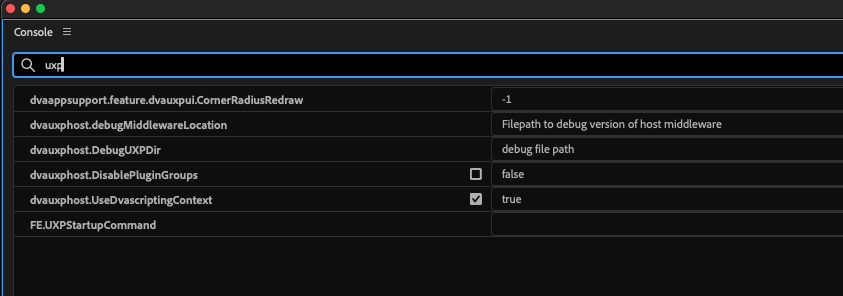

# ReadMe

Getting started developing a Universal Extensibility Platform - UXP panel for Adobe Premiere Pro.

The Premiere Pro UXP API is available here: <https://developer.adobe.com/premiere-pro/uxp/>

## Things you need to begin

- Premiere Pro 25.2.0 BETA (Build 13) or later, available through Creative Cloud Desktop -CCD
- UXP Developer Tool-UDT,Version 2.1.0 (2.1.0.30) which is available for download through CCD
- Adobe third-party sample panel - **3psample-panel** directory available in this repo

## Build the test panel

- Open your console / terminal / command prompt
- cd into the sample-panels/3psample-panel/html directory
- Install dependencies with ```npm i```
- Bulid the project with ```npm run build```
- Then fix import with ```npm run fix-imports``` 
- Panel is now built in the "build-html" directory

*You will see errors after the build command. That doesn't mean the build failed - we are working actively on providing better type definition files to avoid triggering those errors. Please only run fix-imports command after build command for the same reason* 

## How to launch the test panel

- Launch Premiere Pro BETA, and set a feature flag:
  - open a new blank project
  - Enter debug console via: Command + Function + F12
  - Use hamburger menu to select debug database view
  - In the search bar type: uxp
  - Check the box for **dvauxphost.UseDvascriptingContext** to set it to true
  - 
  - Important: the debug console is _not_ a place to experiment.

* Load UDT. On first launch it will be blank. Click the **Add Plugin** button
* Navigate to the location where you downloaded the 3psample-panel
* Select 3psample-panel/build-html/manifest.json, and click **Open**


- Marvel at the magnificent UXP sample panel.


## Adding TypeScript Definitions to VS Code


Add typescript definitions to the .js file you are working in, so that you will see definitions

copy the provided file; types.d.ts to the root of the html directory

Add this line to the top of the index.js file

`/// <reference path="./types.d.ts" />`

###### posted 10DEC2024 dmcsween
