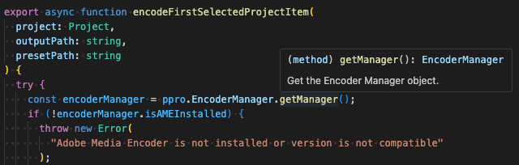
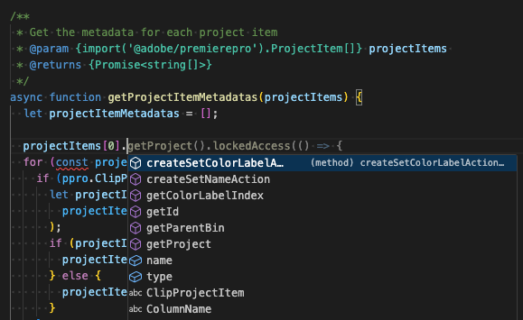

# Sample UXP plugins for Premiere

The Premiere Pro UXP API documentation is available here: <https://developer.adobe.com/premiere-pro/uxp/>.

## Tools

- Premiere or Premiere Beta 25.4 or greater
- UXP Developer Tools 2.2 or greater

### Premiere API

The flagship sample, which exercises the Premiere UXP APIs.

We also provide:

#### Metadata Handler

Port of a popular CEP panel developed specifically for film turnovers; the [plugin](https://adobe.com/go/cc_plugins_discover_plugin?pluginId=1836f173&workflow=share) can be installed (free) via Creative Cloud Desktop.

#### OAuth workflow example

Here's everything we know about OAuth workflows in Premiere, which is not much.

## Build

From a command prompt in `sample-panels/premiere-api/html`:

```bash
npm i
npm run build
```

The built plugin is in  `/premiere-api/build-html` .

## Load and debug

- Launch Premiere (or Premiere Beta).
- Launch UXP Developer Tools (UDT).
- Select **Add Plugin**, and navigate to `/premiere-api/build-html/manifest.json`.


Here's `premiere-api` in Premiere:


## Adding TypeScript Definitions in Visual Studio Code

Install the `@adobe/premierepro` type declaration package. The `premiere-api` and `metadata-handler` sample panels already include this in its dependencies as an example.

```sh
# For current APIs
$ npm install -D @adobe/premierepro

# To see what's available in Beta
$ npm install -D @adobe/premierepro@beta
```

For JavaScript-specific projects: create a `jsconfig.json` file which includes at least the following configuration:
```json
{
  "compilerOptions": {
    "types": ["@adobe/premierepro"]
  },
  "excludes": ["node_modules"]
}
```

You can now see and use TypeScript declarations for Premiere Pro's UXP APIs, in Visual Studio Code, either directly in TypeScript projects:



Or using JSDoc equivalent documentation and tags to add type hints in JavaScript projects:



## Linting

To lint the `premiere-api` sample code and peform some basic static analysis, you can run:

```sh
$ npm run lint
```

This will print out per-file warnings and/or errors that should be fixed before commiting new features to the repository.

## Transcript definition

We have included [Premiere Pro's transcript JSON definition](./sample-panels/premiere-api/html/assets/transcript_format_spec.json), in the `assets` directory, within the `premiere-api` sample plugin.
