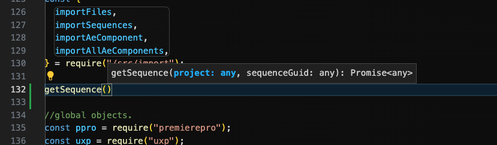

# ReadMe

These instructions explain how to develop UXP plugins within Premiere Pro. [*As of August 2025, only Premiere Pro BETA builds support UXP plugins.*]

The Premiere Pro UXP API documentation is available here: <https://developer.adobe.com/premiere-pro/uxp/>.

## Things you will need

- Premiere Pro BETA build, available through Creative Cloud Desktop.
- UXP Developer Tool, also available for download through Creative Cloud Desktop.
- Adobe third-party sample panel - **premiere-api** directory from this Git repository.

## Build the sample

- Open your console / terminal / command prompt, into ```sample-panels/premiere-api/html```.
- Install dependencies with ```npm i```
- Bulid the project with ```npm run build```

The plugin is now built in the ```/build-html``` directory.

## Display the sample

- Launch Premiere Pro Beta.
- Load UDT. *On first launch it will be blank*.
- Click **Add Plugin**.
- Navigate to the ```premiere-api/build-html/manifest.json```, and click **Open**.


The UXP sample plugin displays in Premiere Pro Beta:


## Adding TypeScript Definitions in Visual Studio Code

To see definitions, add typescript definitions to the .js file in which you are working.

Copy ```types.d.ts``` to the root of the ```/html``` directory.

Add this line to the top of ```index.js```:

`/// <reference path="./types.d.ts" />`

You can now see and use TypeScript definitions for Premiere Pro's UXP APIs, in Visual Studio Code.



## Transcript definition

We have included [Premiere Pro's transcript JSON definition](./sample-panels/premiere-api/html/assets/transcript_format_spec.json), in the ```assets``` directory, within the ```premiere-api``` sample plugin.